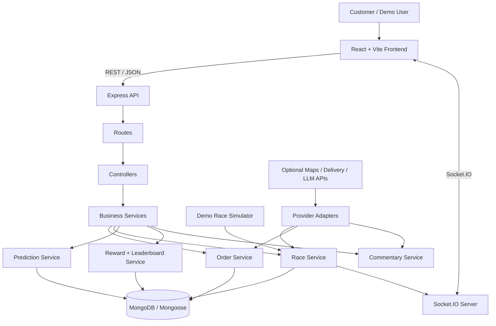
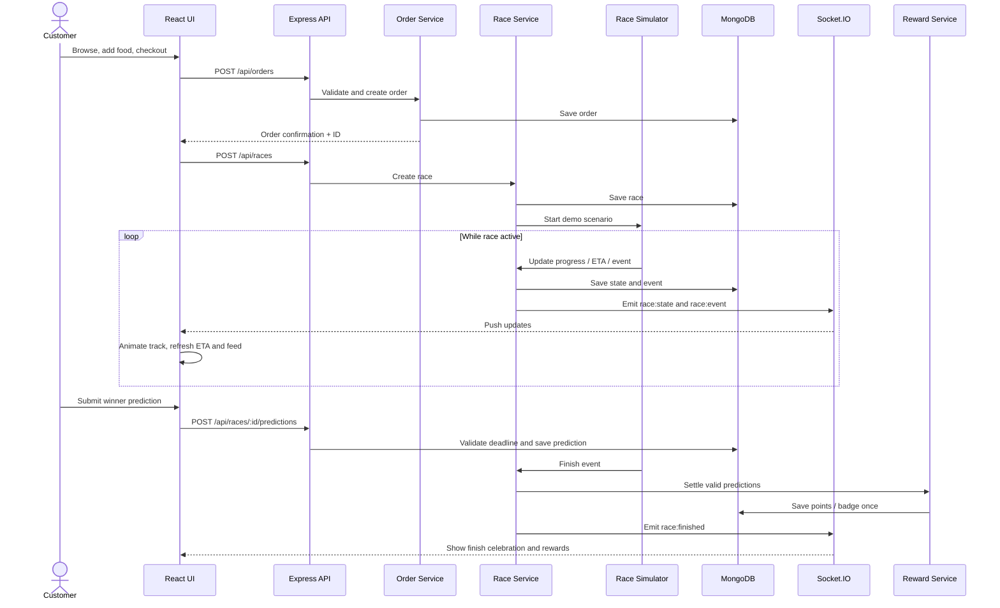

# Gadbad Grub — Complete System Architecture
## Food Delivery Speed Racing

This document defines the full-stack architecture, frontend and backend directory structure, backend responsibilities, data models, API contracts, real-time events, and the end-to-end workflow for Gadbad Grub.

It is based on the team's supplied dashboard and mobile workflow references. The main desktop dashboard contains the Race Watch Hub, Live Updates, Next Orders & Predictions, Competition, Profile & Achievements, and Rewards & Badges. The mobile flow is Place Order → Start Race → Watch Live Race → Predict Winner → Win Rewards.

> **Implementation note:** This is a complete target architecture for a hackathon MVP. Inspect the actual repository before replacing existing files or frameworks. Adapt names and scripts to the current codebase. Demo tracking must be labeled as simulated and must not be represented as actual rider GPS.

---

## 1. Project Goals

1. Build a full-stack food ordering and virtual delivery racing application.
2. Provide a responsive UI matching the supplied reference images.
3. Separate frontend, backend, database, simulator, and optional third-party integrations.
4. Make the full order-to-reward workflow demonstrable in a hackathon.
5. Keep ETA prediction explainable and reward calculations consistent.
6. Make it possible to replace simulated data with provider APIs without rewriting the app.

## 2. Technology Stack

| Layer | Selected approach | Responsibility |
|---|---|---|
| Frontend | React + Vite | Single-page responsive app |
| UI styling | Tailwind CSS + custom CSS | Color system, cards, animations, responsive design |
| Routing | React Router | Home, Order, Race, Leaderboard, Rewards, Profile |
| API client | Axios | REST requests |
| Client state | React Context (or existing state library) | Cart, current user, app-level state |
| Backend | Node.js + Express | REST API and business logic |
| Real-time | Socket.IO | Race state and event broadcasting |
| Database | MongoDB + Mongoose | Persistent application data |
| Validation | Zod or express-validator | Request validation |
| Authentication | JWT optional for MVP | User session and protected actions |
| Testing | Vitest, Supertest | Unit and API tests |

For a three-hour hackathon MVP, build this as a modular monolith: one Express server with separate routes/controllers/services, not many separately deployed microservices.

## 3. Complete Directory Structure

```text
gadbad-grub/
├── README.md
├── ARCHITECTURE.md
├── .gitignore
├── package.json                    # optional root scripts (concurrently)
├── .env.example
│
├── client/                         # FRONTEND: React + Vite
│   ├── package.json
│   ├── vite.config.js
│   ├── index.html
│   ├── .env.example
│   ├── public/
│   │   ├── logo/
│   │   │   └── gadbad-grub-logo.png
│   │   ├── riders/
│   │   ├── food/
│   │   ├── badges/
│   │   └── sounds/
│   └── src/
│       ├── main.jsx
│       ├── App.jsx
│       ├── routes/
│       │   └── AppRoutes.jsx
│       ├── assets/
│       │   ├── images/
│       │   └── styles/
│       │       ├── index.css
│       │       └── theme.css
│       ├── components/
│       │   ├── layout/
│       │   │   ├── AppLayout.jsx
│       │   │   ├── Header.jsx
│       │   │   ├── Sidebar.jsx
│       │   │   ├── BottomNavigation.jsx
│       │   │   └── Footer.jsx
│       │   ├── dashboard/
│       │   │   ├── RaceWatchHub.jsx
│       │   │   ├── LiveUpdates.jsx
│       │   │   ├── NextOrdersPredictions.jsx
│       │   │   ├── CompetitionPanel.jsx
│       │   │   ├── ProfileAchievements.jsx
│       │   │   └── RewardsBadgesPanel.jsx
│       │   ├── race/
│       │   │   ├── RaceMap.jsx
│       │   │   ├── RaceTrack.jsx
│       │   │   ├── RiderMarker.jsx
│       │   │   ├── RaceStatus.jsx
│       │   │   ├── ETAWidget.jsx
│       │   │   ├── RaceEventFeed.jsx
│       │   │   ├── PredictionCard.jsx
│       │   │   └── RaceCommentary.jsx
│       │   ├── orders/
│       │   │   ├── RestaurantCard.jsx
│       │   │   ├── FoodItemCard.jsx
│       │   │   ├── MenuGrid.jsx
│       │   │   ├── CartDrawer.jsx
│       │   │   ├── CartItem.jsx
│       │   │   └── OrderStatusTimeline.jsx
│       │   ├── leaderboard/
│       │   │   ├── LeaderboardTable.jsx
│       │   │   └── RacerRow.jsx
│       │   ├── rewards/
│       │   │   ├── RewardSummary.jsx
│       │   │   ├── BadgeCard.jsx
│       │   │   └── AchievementList.jsx
│       │   └── common/
│       │       ├── Button.jsx
│       │       ├── Loader.jsx
│       │       ├── ErrorMessage.jsx
│       │       └── DemoModeBadge.jsx
│       ├── pages/
│       │   ├── HomePage.jsx
│       │   ├── OrderPage.jsx
│       │   ├── RacePage.jsx
│       │   ├── LeaderboardPage.jsx
│       │   ├── RewardsPage.jsx
│       │   ├── ProfilePage.jsx
│       │   └── NotFoundPage.jsx
│       ├── context/
│       │   ├── CartContext.jsx
│       │   └── AuthContext.jsx
│       ├── hooks/
│       │   ├── useRaceSocket.js
│       │   ├── useRace.js
│       │   └── useAuth.js
│       ├── services/
│       │   ├── apiClient.js
│       │   ├── orderApi.js
│       │   ├── raceApi.js
│       │   ├── predictionApi.js
│       │   ├── leaderboardApi.js
│       │   └── rewardsApi.js
│       ├── utils/
│       │   ├── formatTime.js
│       │   ├── formatCurrency.js
│       │   └── constants.js
│       └── tests/
│
├── server/                         # BACKEND: Node + Express
│   ├── package.json
│   ├── server.js                   # HTTP + Socket.IO startup
│   ├── app.js                      # Express setup and middleware
│   ├── .env.example
│   ├── config/
│   │   ├── env.js
│   │   └── database.js
│   ├── routes/
│   │   ├── index.js
│   │   ├── restaurant.routes.js
│   │   ├── order.routes.js
│   │   ├── race.routes.js
│   │   ├── prediction.routes.js
│   │   ├── leaderboard.routes.js
│   │   ├── reward.routes.js
│   │   └── user.routes.js
│   ├── controllers/
│   │   ├── restaurant.controller.js
│   │   ├── order.controller.js
│   │   ├── race.controller.js
│   │   ├── prediction.controller.js
│   │   ├── leaderboard.controller.js
│   │   ├── reward.controller.js
│   │   └── user.controller.js
│   ├── services/
│   │   ├── restaurant.service.js
│   │   ├── order.service.js
│   │   ├── race.service.js
│   │   ├── prediction.service.js
│   │   ├── leaderboard.service.js
│   │   ├── reward.service.js
│   │   └── commentary.service.js
│   ├── models/
│   │   ├── User.js
│   │   ├── Restaurant.js
│   │   ├── MenuItem.js
│   │   ├── Order.js
│   │   ├── Race.js
│   │   ├── RaceEvent.js
│   │   ├── Prediction.js
│   │   └── Reward.js
│   ├── middleware/
│   │   ├── error.middleware.js
│   │   ├── notFound.middleware.js
│   │   ├── validate.middleware.js
│   │   └── auth.middleware.js
│   ├── validators/
│   │   ├── order.validator.js
│   │   └── prediction.validator.js
│   ├── sockets/
│   │   ├── socket.js
│   │   └── race.socket.js
│   ├── simulator/
│   │   ├── raceSimulator.js
│   │   ├── demoRacers.js
│   │   └── demoScenarios.js
│   ├── adapters/
│   │   ├── maps.adapter.js
│   │   ├── delivery.adapter.js
│   │   └── llm.adapter.js
│   ├── utils/
│   │   ├── ApiError.js
│   │   ├── asyncHandler.js
│   │   ├── generateId.js
│   │   └── ranking.js
│   ├── seed/
│   │   ├── seed.js
│   │   ├── restaurants.seed.js
│   │   └── users.seed.js
│   └── tests/
│       ├── order.test.js
│       ├── race.test.js
│       └── prediction.test.js
│
└── docs/
    ├── API.md
    └── DEMO_FLOW.md
```

This is the full target tree. The MVP can combine small files when necessary, but keep client and server code separated.

## 4. System Architecture



### Request lifecycle

1. React page calls an API function in `client/src/services`.
2. Axios sends the request to Express.
3. Express route applies validation/auth middleware and invokes a controller.
4. Controller calls a service.
5. Service applies business rules and accesses MongoDB through Mongoose models.
6. Controller returns a consistent JSON response.
7. For race changes, the race service emits Socket.IO events to the relevant race room.
8. The frontend hook receives the event and updates the map, ETA, feed, and leaderboard.

## 5. Backend Responsibilities

### Order Service
- Fetch restaurants and menus.
- Validate cart item IDs and quantities.
- Calculate order total from trusted database menu prices.
- Create an order and unique order ID.
- Maintain order status and timestamps.
- Trigger race creation after order acceptance or pickup, according to the selected demo flow.

### Race Service
- Create a race linked to an order.
- Store racer identity, progress, ETA, status, and tracking source.
- Apply simulator/provider updates.
- Save race events and broadcast state changes.
- Mark races finished and initiate prediction settlement.

### Race Simulator
- Run deterministic demo scenarios with configurable tick interval.
- Simulate rider progress, checkpoints, pickup, traffic events, ETA changes, and finish.
- Emit updates through the race service.
- Stop timers when a race finishes or server shuts down.
- Never control real rider movement.

### Prediction Service
- Return a predicted winner using ETA-based ranking.
- Accept user predictions only before the race finishes.
- Store prediction and submission time.
- Validate prediction result after finish.
- Use explainable rule-based logic for the MVP.
- Do not claim calibrated confidence or a trained ML model unless it exists and has been evaluated.

### Leaderboard Service
- Sort active racers by lowest valid ETA.
- Apply a deterministic tie-breaker.
- Return racer name, ETA, progress, and rank.
- Optionally return user rankings and completed race scores.

### Reward Service
- Award XP, points, and badges for valid actions.
- Settle correct predictions after a race completes.
- Prevent duplicate awards using unique source-event/idempotency keys.
- Return profile reward summary and history.

### Commentary Service
- Convert race events into short, playful messages.
- Use an optional LLM provider through `llm.adapter.js`.
- Provide fallback templates when no key/provider is configured.
- Keep provider secrets on the backend.

## 6. Database Design

### User
```text
User {
  _id,
  displayName,
  email?,
  passwordHash?,
  avatar,
  points,
  xp,
  badges: [],
  createdAt,
  updatedAt
}
```

### Restaurant
```text
Restaurant {
  _id,
  name,
  description,
  rating,
  imageUrl,
  isAvailable,
  createdAt
}
```

### MenuItem
```text
MenuItem {
  _id,
  restaurantId,
  name,
  description,
  price,
  imageUrl,
  isAvailable
}
```

### Order
```text
Order {
  _id,
  userId,
  restaurantId,
  items: [{ menuItemId, name, quantity, unitPrice }],
  total,
  status: placed | preparing | picked_up | out_for_delivery | delivered | cancelled,
  estimatedDeliveryAt,
  createdAt,
  updatedAt
}
```

### Race
```text
Race {
  _id,
  orderId,
  racerId,
  racerName,
  progress,            // 0 to 100 for virtual demo
  etaSeconds,
  status: waiting | racing | finished | cancelled,
  trackingSource: simulated | provider,
  routePoints: [],
  updatedAt,
  finishedAt?
}
```

### RaceEvent
```text
RaceEvent {
  _id,
  raceId,
  type,
  message,
  metadata: {},
  source: simulator | provider,
  createdAt
}
```

### Prediction
```text
Prediction {
  _id,
  userId,
  raceId,
  predictedRacerId,
  submittedAt,
  result: pending | correct | incorrect | void,
  pointsAwarded
}
```

### Reward
```text
Reward {
  _id,
  userId,
  type,
  points,
  badgeCode?,
  sourceEventId,
  createdAt
}
```

Recommended indexes:
- `Order`: userId, status, createdAt
- `Race`: orderId, status, updatedAt
- `RaceEvent`: raceId + createdAt
- `Prediction`: unique compound index `{ userId: 1, raceId: 1 }` if one prediction per user per race
- `Reward`: unique source-event/idempotency key to prevent duplicate awards

## 7. REST API Design

Base URL: `http://localhost:5000/api`

| Method | Endpoint | Description |
|---|---|---|
| GET | `/health` | Health check |
| GET | `/restaurants` | List restaurants |
| GET | `/restaurants/:id/menu` | List menu items |
| POST | `/orders` | Place an order |
| GET | `/orders/:id` | Get order details |
| GET | `/orders/user/:userId` | List user's orders |
| PATCH | `/orders/:id/status` | Update demo/admin order status |
| POST | `/races` | Create/start race for an order |
| GET | `/races` | Get active races |
| GET | `/races/:id` | Get race state |
| GET | `/races/:id/events` | Get race events |
| POST | `/races/:id/predictions` | Submit winner prediction |
| GET | `/leaderboard` | Get race leaderboard |
| GET | `/users/:id/profile` | Get user profile |
| GET | `/users/:id/rewards` | Get reward history |

### Create order request example
```json
{
  "userId": "demo-user-id",
  "restaurantId": "restaurant-id",
  "items": [
    { "menuItemId": "menu-item-id", "quantity": 1 }
  ]
}
```

### Success response
```json
{
  "success": true,
  "data": {},
  "message": "Order created"
}
```

### Error response
```json
{
  "success": false,
  "message": "Human-readable error",
  "code": "VALIDATION_ERROR"
}
```

These are API contracts; use real database IDs and actual validation in the implementation.

## 8. Socket.IO Event Design

| Event | Direction | Purpose |
|---|---|---|
| `race:join` | Client → Server | Join room for race ID |
| `race:state` | Server → Client | Current progress, ETA, status, and tracking source |
| `race:event` | Server → Client | Pickup, checkpoint, traffic, boost visual, or finish update |
| `race:leaderboard` | Server → Client | Updated racer ranking |
| `race:finished` | Server → Client | Final result and prediction settlement status |

Example `race:state`:
```json
{
  "raceId": "demo-race-id",
  "progress": 65,
  "etaSeconds": 420,
  "status": "racing",
  "trackingSource": "simulated",
  "updatedAt": "2026-01-01T12:00:00.000Z"
}
```

The frontend should show a visible “Demo / Simulated Tracking” indicator whenever `trackingSource` is simulated.

## 9. Race Ranking and ETA Algorithm

### Ranking
Sort active racers by ascending valid `etaSeconds`. If tied, sort by descending progress, then stable racer ID. Do not rank based on actual driving speed.

### Simple simulated ETA
```text
remainingProgress = 100 - progress
etaSeconds = remainingProgress / virtualProgressRate
```

The real implementation should handle invalid values, preparation time, race completion, and provider ETA where available.

### Prediction confidence
Do not show a random confidence percentage. If a confidence score is included, document the formula and label it as a demo estimate unless calibrated against real historical data.

## 10. Complete End-to-End Workflow



## 11. Environment Configuration

Root/server `.env.example`:
```env
PORT=5000
NODE_ENV=development
CLIENT_ORIGIN=http://localhost:5173
MONGODB_URI=mongodb://127.0.0.1:27017/gadbad_grub
JWT_SECRET=replace_with_a_long_random_secret

DEMO_MODE=true
RACE_TICK_MS=2000

MAPS_API_KEY=
LLM_API_KEY=
LLM_MODEL=
```

Client `.env.example`:
```env
VITE_API_BASE_URL=http://localhost:5000/api
VITE_SOCKET_URL=http://localhost:5000
VITE_DEMO_MODE=true
```

Only `VITE_` variables are exposed to the browser. Never put MongoDB credentials, JWT secrets, or LLM keys in client environment variables.

## 12. Running Locally

Prerequisites: Node.js LTS, npm, and MongoDB (local or hosted).

Backend:
```bash
cd server
npm install
npm run dev
```

Frontend in a second terminal:
```bash
cd client
npm install
npm run dev
```

Seed demo data using the script defined in `server/package.json`, for example:
```bash
cd server
npm run seed
```

The `dev` and `seed` scripts must be defined in the actual package files. Verify commands against the repository before documenting them as final.

## 13. Testing Plan and Evaluation

| Area | Test |
|---|---|
| Order flow | Add items, submit order, verify total and order confirmation |
| Race simulator | Progress, checkpoints, ETA, and finish state update |
| Real-time updates | Measure backend-event to UI update latency |
| Ranking | Check output against ETA sorting rule |
| Prediction | Reject predictions after race completion |
| Rewards | Verify reward settlement occurs once |
| Responsive UI | Test desktop, tablet, and mobile |
| Error handling | Test unavailable DB/API, invalid input, and missing ETA |

Proposed hackathon demo targets (not measured claims):
- Aim for race updates within 2 seconds in the local demo.
- Ensure leaderboard matches the defined ETA ranking rule.
- Ensure no duplicate reward settlement in tested scenarios.
- Ensure all core navigation and flow actions work.
- Ensure mobile pages have no horizontal overflow.

## 14. Security, Reliability, and Safety

- Validate all request payloads and IDs.
- Recalculate order prices from trusted menu data on the backend.
- Keep secrets server-side.
- Protect admin status-change endpoints before public deployment.
- Enforce prediction deadlines and reward idempotency in the backend.
- Add authentication and rate limiting for a public deployment.
- Clearly label simulated tracking.
- Do not encourage speeding, unsafe shortcuts, or risky delivery behavior.
- Provide accessible text alternatives to animated and color-coded map states.

## 15. Future Enhancements

- Restaurant and menu provider integrations.
- Authorized delivery tracking provider integration.
- ETA improvements using historical data.
- Friend challenges and multiplayer races.
- LLM-based commentary with moderation and fallback.
- Localization, accessibility improvements, and restaurant analytics.

---

**Gadbad Grub — Don't Just Track Your Food. Race It!**
